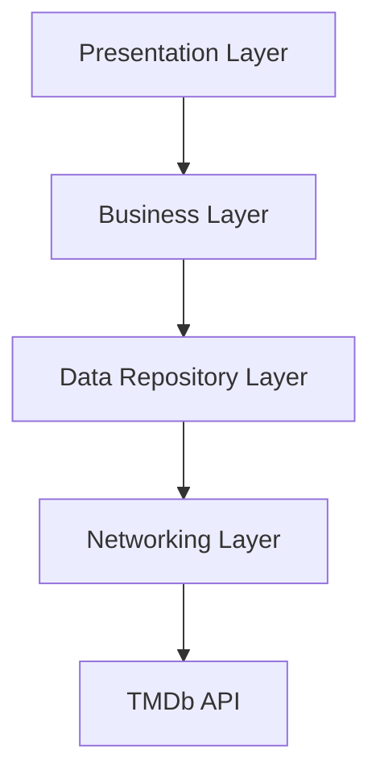

# TheMovieDB App


## Table of Contents
1. [Project Overview](#project-overview)
2. [Architecture](#architecture)
3. [Modules](#modules)
4. [Key Features](#key-features)
5. [Assumptions and Challenges](#assumptions-and-challenges)
6. [Getting Started](#getting-started)
7. [Development](#development)
8. [Dependency Management](#dependency-management)
9. [Performance Considerations](#performance-considerations)
10. [Future Improvements](#future-improvements)

## Project Overview

The Movie Database App is an iOS application that showcases movies using the [TMDb API](https://developers.themoviedb.org/). It allows users to browse popular movies, search for specific titles, and view detailed information about each movie including similar movies and cast information.

### High-Level Architecture Diagram



## Architecture

The project follows Clean Architecture principles, utilizing the MVVM-C (Model-View-ViewModel-Coordinator) pattern in the presentation layer. It's designed with modularity in mind, separating concerns into distinct layers:

1. **Presentation Layer (themoviedb)**: Implements the user interface and handles user interactions.
2. **Domain Layer (BusinessLayer)**: Contains the core business logic and use cases.
3. **Data Layer (DataRepository)**: Abstracts the data sources and provides a clean API for the domain layer.
4. **Networking Layer (APIGate)**: Handles all network communications.

## Modules

### 1. APIGate
- Responsible for network communication
- Implements `URLSessionNetworking`
- Defines network protocols and endpoints
- Handles network errors and authentication

### 2. DataRepository
- Abstracts data sources
- Implements `MovieRepository`
- Defines Data Transfer Objects (DTOs)
- Handles data-related errors

### 3. BusinessLayer
- Implements use cases (e.g., `FetchPopularMoviesUseCase`, `SearchMoviesUseCase`)
- Defines business logic and rules
- Handles business-related errors

### 4. themoviedb (Main App)
- Implements the MVVM-C pattern
- Contains scenes for movie list and details
- Implements coordinators for navigation
- Manages image caching and loading
- Combines UIKit and SwiftUI views

## Key Features
- Paginated list of popular movies grouped by year
- Search functionality for finding specific movies
- Detailed view for each movie with:
  - Movie metadata (rating, release date, vote count)
  - Similar movies recommendations
  - Cast information (top 5 actors and directors)
- Asynchronous image loading with memory and disk caching
- Hybrid UI implementation (UIKit + SwiftUI)
- Pull-to-refresh functionality
- Smooth infinite scrolling

## Assumptions and Challenges

### Assumptions
- The project assumes a hybrid approach using both UIKit and SwiftUI, with UITableView for the main movie list for optimal performance and SwiftUI for detail views and components.
- The app is designed to work with iOS 14.0 and above to support a wide range of devices while still utilizing modern Swift features.

### Challenges
- **Image Loading**: Implementing efficient image loading and caching system for smooth scrolling performance.
- **Data Grouping**: Organizing movies by year while maintaining smooth pagination.
- **State Management**: Handling complex state management between search and popular movies modes.

### Architectural Decisions
- **Interface-Driven Communication**: All modules communicate through protocols, enhancing scalability and maintainability.
- **Dependency Injection**: Each module uses dependency injection containers to manage object creation and lifetime.
- **MVVM-C with Clean Architecture**: Separation of concerns allowing for better maintainability and future scalability.
- **Hybrid UI Approach**: Using UIKit for performance-critical views and SwiftUI for modern, declarative UI components.

## Getting Started

### Prerequisites
- Xcode 14.0+
- iOS 14.0+
- Swift 5.5+
- TMDb API Key "This is intended for the production concept, but since it’s part of a POC, it can be ignored"
 
### Installation
1. Clone the repository
2. Create a `Configuration.json` file in the project root with your TMDb API key "This is intended for the production concept, but since it’s part of a POC, it can be ignored"
3. Open `themoviedb.xcodeproj` in Xcode
4. Build and run the project

## Development

### Project Structure
```
themoviedb/
├── APIGate/
│   ├── NetworkLayer/
│   ├── Protocols/
│   └── Configuration/
├── DataRepository/
│   ├── Repositories/
│   ├── DTOs/
│   └── Endpoints/
├── BusinessLayer/
│   ├── UseCases/
│   └── Protocols/
├── themoviedb/
│   ├── Presentation/
│   │   ├── Movies/
│   │   ├── Details/
│   │   └── Common/
│   ├── Coordinator/
│   └── App/
```

### Adding a New Feature
1. Determine which module(s) will be affected
2. Implement necessary data structures in DataRepository if required
3. Add business logic in BusinessLayer if needed
4. Implement the UI components
5. Update coordinators if the feature requires navigation changes
6. Update Dependency Injection Containers as needed

## Dependency Management

The project doesn't use external dependencies, implementing all functionality with native frameworks to maintain simplicity and control.

## Performance Considerations

- Efficient image caching system with memory and disk caching
- Pagination implementation for movie lists
- Optimized table view cell reuse
- Debounced search functionality
- Proper cancellation of network requests
- Smooth scrolling performance

## Future Improvements

- Add watchlist functionality with local storage
- Implement offline mode support
- Add more filter options (genre, year, rating)
- Enhance movie details with trailers and reviews
- Add user authentication and ratings
- Implement shared transitions between list and detail views
- Add localization support
- Enhance accessibility features
- Add iPad support with master-detail layout

---

For any questions or support, please open an issue in the repository or contact the maintainers directly.
